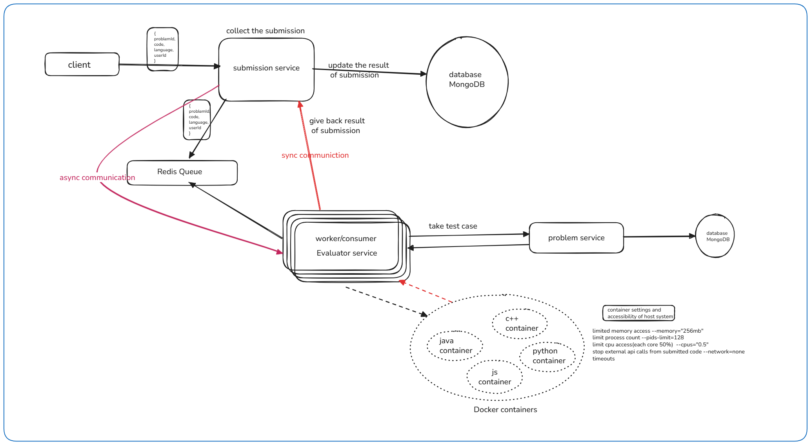

# Online Judge

## 🚀 Project Overview

This project implements a distributed architecture consisting of three core microservices that work together to provide a complete coding platform experience. The system enables users to browse coding problems, submit solutions, and receive real-time evaluation results with detailed feedback.

## 🏗️ Architecture

The system follows a microservices architecture pattern with the following components:

### Core Services

#### 1. **ProblemService**

- **Purpose**: Manages coding problems and their metadata
- **Responsibilities**:
  - CRUD operations for coding problems
  - Problem search and filtering by difficulty
  - Markdown sanitization for problem descriptions
  - Test case management
- **Database**: MongoDB
- **Key Features**:
  - Problem creation, retrieval, and management
  - Difficulty-based filtering (Easy, Medium, Hard)
  - Full-text search across problem titles and descriptions
  - Sanitized markdown rendering for security

#### 2. **SubmissionService**

- **Purpose**: Handles code submission lifecycle and queue management
- **Responsibilities**:
  - Submission creation and validation
  - Queue management using Redis and BullMQ
  - Submission status tracking
  - Integration with ProblemService for validation
- **Database**: MongoDB
- **Queue System**: Redis with BullMQ
- **Key Features**:
  - Asynchronous submission processing
  - Job retry mechanism with exponential backoff
  - Submission history and status tracking
  - Multi-language support (Python, C++)

#### 3. **EvaluationService**

- **Purpose**: Executes and evaluates submitted code using Docker containers
- **Responsibilities**:
  - Code execution in isolated Docker environments
  - Test case validation
  - Performance monitoring (time and memory limits)
  - Result compilation and reporting
- **Container Technology**: Docker
- **Queue System**: Redis with BullMQ
- **Key Features**:
  - Secure code execution with resource limits
  - Multiple programming language support
  - Comprehensive error handling and timeout management
  - Detailed execution results (AC, WA, TLE, Error)

## ✨ Key Features

### Problem Management

- **Rich Problem Descriptions**: Support for markdown-formatted problem statements with sanitization
- **Difficulty Classification**: Easy, Medium, and Hard difficulty levels
- **Test Case Management**: Comprehensive test case storage and validation
- **Search Functionality**: Full-text search across problem titles and descriptions

### Submission Handling

- **Asynchronous Processing**: Non-blocking submission processing using message queues
- **Multi-language Support**: Python and C++ execution environments
- **Status Tracking**: Real-time submission status updates (Pending, Processing, Completed, Failed)
- **Retry Mechanism**: Automatic retry for failed evaluations with exponential backoff

### Code Evaluation

- **Secure Execution**: Docker-based code isolation with resource constraints
- **Performance Monitoring**:
  - Memory limit: 1GB per execution
  - CPU quota: 50% of available resources
  - Process limit: 100 processes per container
- **Network Isolation**: No network access for security
- **Comprehensive Results**: Detailed verdicts including:
  - **AC** (Accepted): Solution passed all test cases
  - **WA** (Wrong Answer): Solution failed test cases
  - **TLE** (Time Limit Exceeded): Solution exceeded time constraints
  - **Error**: Runtime or compilation errors

### System Features

- **Microservices Architecture**: Independent, scalable service deployment
- **Message Queue Integration**: Redis-based asynchronous processing
- **Comprehensive Logging**: Winston-based structured logging with daily rotation
- **Error Handling**: Centralized error management across all services
- **API Versioning**: Support for multiple API versions (v1, v2)
- **Correlation Tracking**: Request correlation IDs for distributed tracing

## 🛠️ Technology Stack

### Backend Framework

- **Node.js** with **TypeScript**
- **Express.js** for REST API development
- **MongoDB** with **Mongoose** for data persistence
- **Redis** for caching and message queuing
- **BullMQ** for job queue management

### Code Execution

- **Docker** for containerized code execution
- **Dockerode** for Docker API integration
- **Custom container images** for different programming languages

### Development Tools

- **Winston** for structured logging
- **Zod** for schema validation
- **UUID** for unique identifier generation
- **Axios** for HTTP client operations

## 📁 Project Structure

```
Leetcode-backend/
├── ProblemService/           # Problem management microservice
│   ├── src/
│   │   ├── controllers/      # Request handlers
│   │   ├── models/          # Database models
│   │   ├── repository/      # Data access layer
│   │   ├── service/         # Business logic
│   │   ├── routers/         # API route definitions
│   │   ├── validators/      # Input validation
│   │   └── utils/           # Utility functions
│   └── package.json
├── SubmissionService/        # Submission handling microservice
│   ├── src/
│   │   ├── controllers/     # Submission endpoints
│   │   ├── producer/        # Queue job producers
│   │   ├── queues/          # Redis queue configuration
│   │   ├── service/         # Submission business logic
│   │   └── api/             # External service integrations
│   └── package.json
├── EvaluationService/        # Code evaluation microservice
│   ├── src/
│   │   ├── worker/          # Background job processors
│   │   ├── utils/container/ # Docker integration utilities
│   │   ├── config/          # Language-specific configurations
│   │   └── api/             # Service communication
│   └── package.json
└── snaps/                   # Documentation images
```

## 🔄 System Workflow

1. **Problem Creation**: Administrators create coding problems through ProblemService
2. **Problem Discovery**: Users browse and search problems via ProblemService APIs
3. **Code Submission**: Users submit solutions through SubmissionService
4. **Queue Processing**: Submissions are queued for asynchronous processing
5. **Code Evaluation**: EvaluationService processes jobs and executes code in Docker containers
6. **Result Reporting**: Evaluation results are stored and made available to users

## 🚀 Getting Started

### Prerequisites

- Node.js (v16 or higher)
- MongoDB
- Redis
- Docker
- TypeScript

### Installation

1. **Clone the repository**

   ```bash
   git clone <repository-url>
   cd Leetcode-backend
   ```

2. **Install dependencies for each service**

   ```bash
   cd ProblemService && npm install
   cd ../SubmissionService && npm install
   cd ../EvaluationService && npm install
   ```

3. **Set up environment variables**

   - Configure database connections
   - Set Redis connection details
   - Configure Docker settings

4. **Start the services**

   ```bash
   # Start ProblemService
   cd ProblemService && npm run dev

   # Start SubmissionService
   cd SubmissionService && npm run dev

   # Start EvaluationService
   cd EvaluationService && npm run dev
   ```

## 📊 API Endpoints

### ProblemService

- `GET /api/v1/problems` - List all problems
- `GET /api/v1/problems/:id` - Get problem by ID
- `POST /api/v1/problems` - Create new problem
- `PUT /api/v1/problems/:id` - Update problem
- `DELETE /api/v1/problems/:id` - Delete problem
- `GET /api/v1/problems/search?q=query` - Search problems

### SubmissionService

- `POST /api/v1/submissions` - Submit code solution
- `GET /api/v1/submissions/:id` - Get submission status
- `GET /api/v1/submissions/problem/:problemId` - Get submissions for a problem

### EvaluationService

- Background service for code evaluation
- Webhook endpoints for result updates

## 🔧 Configuration

Each service requires configuration for:

- Database connections (MongoDB)
- Redis connection settings
- Docker container images
- Logging configurations
- API versioning settings

## 📈 Scalability Considerations

- **Horizontal Scaling**: Each microservice can be scaled independently
- **Queue-based Processing**: Asynchronous job processing for high throughput
- **Container Orchestration**: Docker-based execution allows for easy scaling
- **Database Optimization**: Indexed queries and efficient data modeling
- **Caching Strategy**: Redis-based caching for improved performance

## 🔒 Security Features

- **Input Sanitization**: Markdown sanitization to prevent XSS attacks
- **Container Isolation**: Network-isolated Docker containers
- **Resource Limits**: Memory, CPU, and process limits on code execution
- **Validation**: Comprehensive input validation using Zod schemas
- **Error Handling**: Secure error messages without sensitive information exposure

## 📝 Logging and Monitoring

- **Structured Logging**: Winston-based logging with daily rotation
- **Correlation IDs**: Distributed tracing across microservices
- **Error Tracking**: Comprehensive error logging and monitoring
- **Performance Metrics**: Execution time and resource usage tracking

---

This system provides a robust, scalable foundation for a LeetCode-style coding platform with secure code execution, comprehensive problem management, and efficient submission processing.
